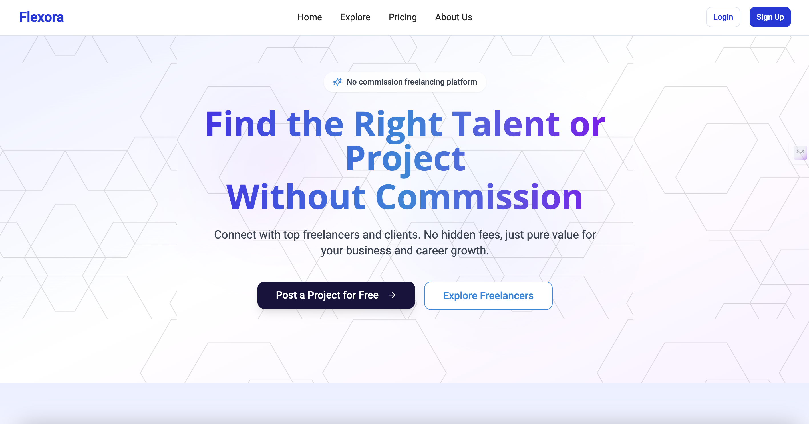
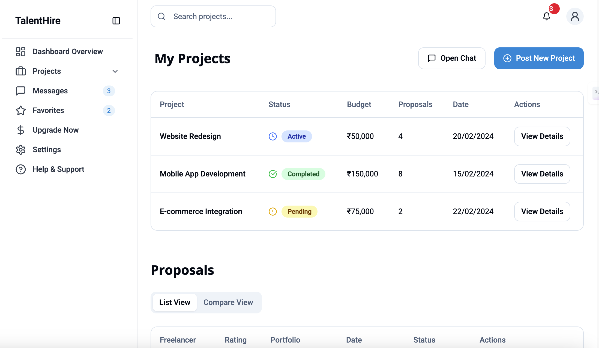
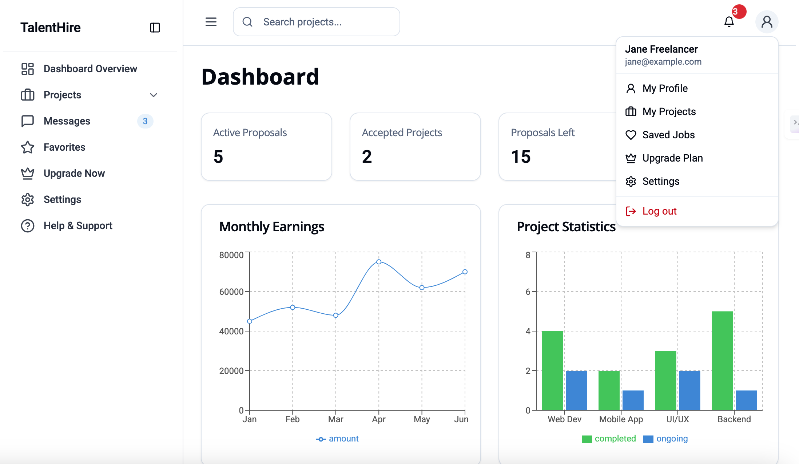

# Flexora


## ClientDashboard
 

## Freelancer Dashboard
 
  
 ## [Click Here for Live Demo of flexora ](https://flexorafree.netlify.app/) 

## Description
Flexora is a freelancing platform designed to facilitate seamless connections between clients (small businesses, startups, and enterprises) and freelancers across various fields. With an easy-to-use interface, clients can post projects, review proposals, and make informed decisions by comparing freelancer proposals. Freelancers, on the other hand, can browse available projects, submit proposals, and build their portfolios.

Key features include:

- Real-time communication via chat and calls
- Client dashboard for managing project bids and reviewing proposals
- Freelancer dashboard for viewing available projects and submitting proposals
- Premium features for clients and freelancers to unlock additional functionalities

## Installation
1. Clone the repository
```bash
git clone https://github.com/yourusername/talenthire.git
cd talenthire
```
2. Install dependencies
```bash
npm install
# or
bun install
```
3. Start development server
```bash
npm run dev
# or
bun run dev
```

## Usage
**Clients:**
  - Post projects with detailed descriptions and budget estimates
  - Review proposals from freelancers
  - Compare proposals based on skills, portfolio, and experience
  - View freelancer profiles and contact details by purchasing premium plans
  - Manage multiple ongoing collaborations

**Freelancers:**
  - Browse available projects across multiple categories
  - Submit unlimited proposals to projects with a premium plan
  - Showcase portfolio and skills in a detailed profile
  - Contact clients directly through chat or call
  - Receive feedback and ratings for each completed project
 
 **Clients Dashboard:**
  - View and manage posted projects
  - Compare freelancer proposals
  - Track project progress and timelines
  - Manage payments and billing

 **Freelancer Dashboard:**
  - Browse projects and submit proposals
  - Track proposal status and messages from clients
  - Manage personal portfolio and project history

## Features
- Client Dashboard: Manage projects, track proposals, review freelancers
- Freelancer Profiles: Showcase portfolios, skills, and work experience
- Project Posting & Bidding System: Clients post projects, and freelancers submit proposals
- Real-time Communication: In-app chat and calling features for project discussions
- Review & Rating System: Both freelancers and clients can leave ratings and reviews after project completion
 ***Premium Features:***
  - Unlimited proposals for freelancers
  - Full access to freelancer contact details for clients
- Secure Payment Integration for easy and reliable payments
- Onboarding Process: Seamless signup process for both freelancers and clients
- Responsive Design: Optimized for mobile and desktop

## Technologies Used
- TypeScript
- React
- Vite
- Tailwind CSS
- Shadcn UI Components
- React Router
- Axios
- Sonner Toasts

## Contributing
Contributions welcome! Please fork the repository and submit pull requests.

## License
MIT

## Contact
lahorivenkatesh709@gmail.com

## Acknowledgments
- Shadcn UI for component library
- Vite for fast development tooling
- Tailwind CSS for utility-first styling


